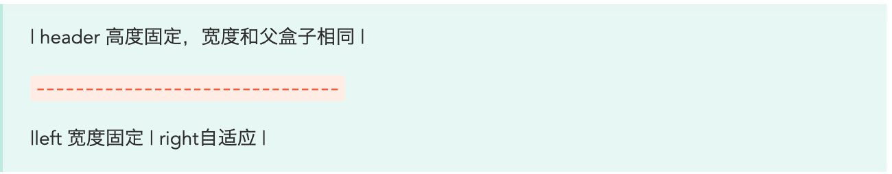

#### 第二个子元素的高度是多少

```html
<div class="container">
    <div style="height: 100px"></div>
    <div style="min-height: 10px"></div>
</div>
<style>
    .container{
        display: flex;
    }
    .container > div {
        width: 100px;
    }
</style>

```


#### flex:1 有什么含义，有什么其他参数，如何在一行显示按比例分布？

#### 说一下你了解的flex布局.....

#### flex-shrink是什么？

#### 如何实现以下布局？经过面试官提示，用两个flex，上下纵向flex，下边的左右横向flex。



#### 改变row和column是什么属性去改变？flex-direction

#### flex-basis和直接设置元素的外框高哪个优先级高？ flex-basis 优先级高

#### 讲一下两个盒子如何让一个固定在左边,一个固定在右边?

#### flex grid与table 的区别

#### flex：1，会不会在一些移动端（如安卓机等）出问题，如何解决
