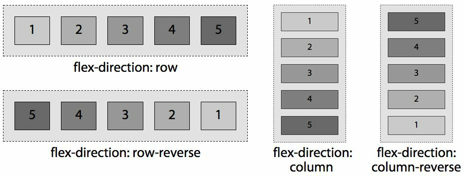
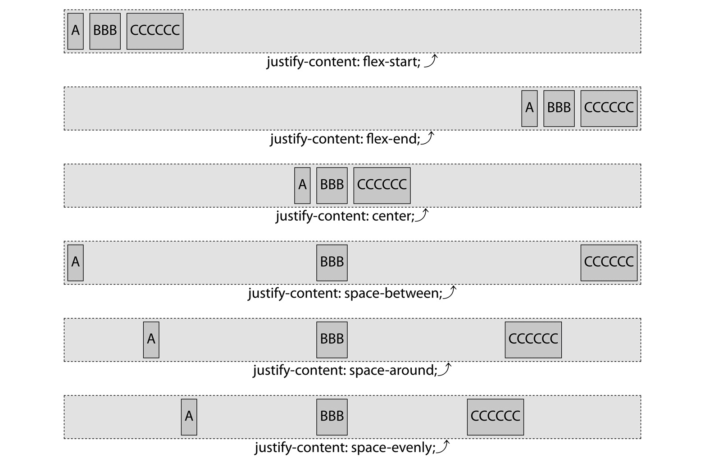
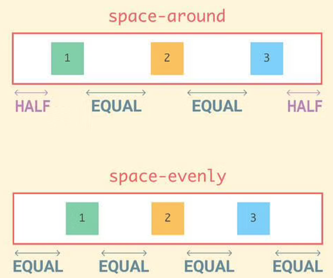
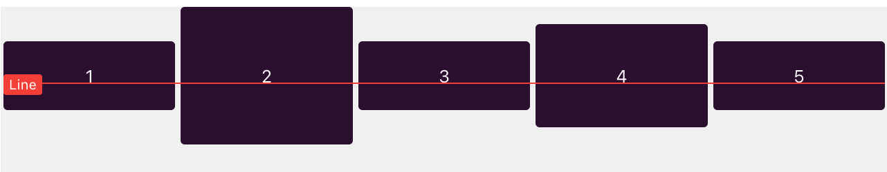

## Flex基础

特点：

1. 内容呈现不受源码顺序的限制
2. 元素能适应不同的 屏幕/设别 尺寸
3. 没有方向性(块级元素 纵向 行内元素 横向)
4. 一维内容布局

触发flex：

1. display: flex(块级) / inline-flex(行内块级)
2. 直接子元素成为flex布局

(简洁)

## 属性

flex-direction：(使用dir修改从右至左的语言布局 or writing-mode)

1. row row-reverse
2. column column-reverse

flex-wrap: (默认不换行)

flex-flow: flex-direction || flex-wrap

justify-content

align-items:

align-items：baseline

align-self： (覆盖align-items)

`alignItems` applies the alignment on to it's **children** while `alignSelf` applies the alignment to  **itself** .

align-content： (覆盖align-items)

### Flex 属性

[flex-grow flex-shrink || flex-basis]
